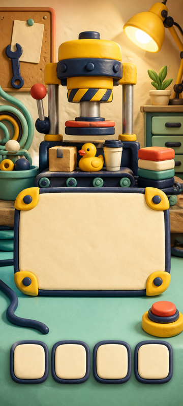
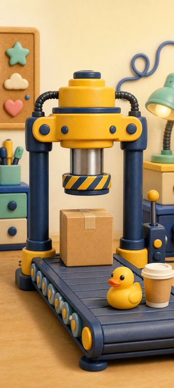
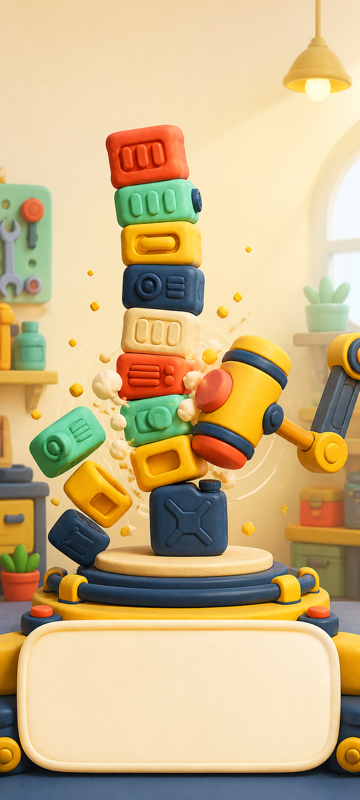
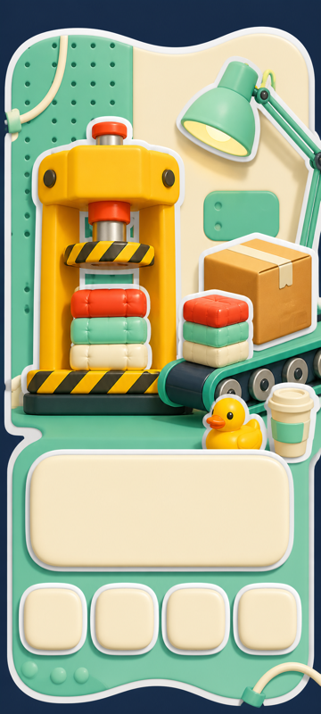
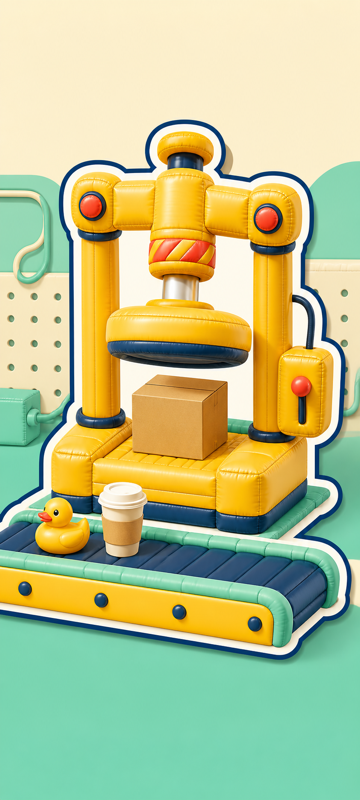
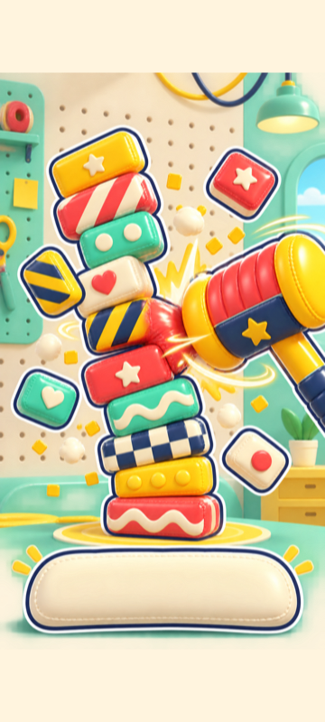
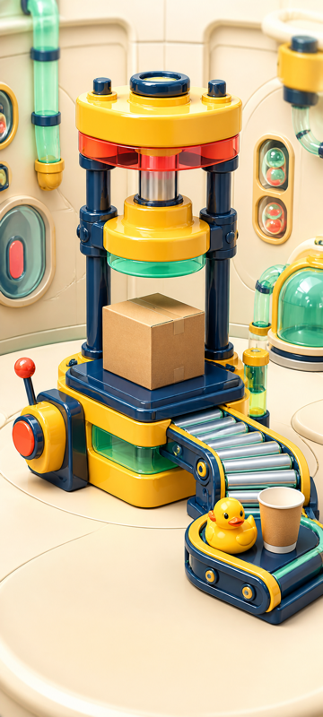
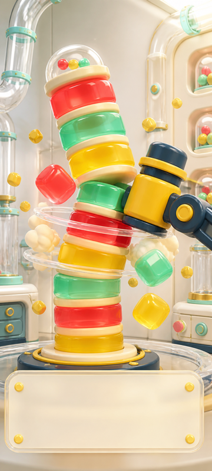

# 《给我压扁！》三套完整视觉方向探索

版本：1.0-draft
任务：GWP-011
状态：候选方向，尚未批准

## 1. 比较方法

三套方向使用同一套冻结输入：相同的主入口信息层级、液压机舞台、高塔粉碎结构、代表物品和基础色板。方向之间只改变材质、轮廓、光影、装饰与字体气质，不改变 `GWP-010` 锁定的信息架构。

每套包含：

- 主入口关键视觉示意。
- 游戏舞台关键视觉示意。
- 高塔粉碎/关卡结果关键视觉示意。
- 包含液压机、传送带、快递纸箱、橡皮鸭、纸杯、面板、按钮、徽章、进度条和装饰母题的视觉语言板。
- 主入口、游戏舞台和结果场景各一张 360×800 可读性预览。

所有文件均位于 `candidates/` 或 `previews/`，没有进入批准资产目录；图片不承担最终文字、图标或 UI 排版，后续仍由 Figma 完成。

## 2. 方向 A：软陶工业玩具

### 2.1 定义

- 核心气质：温暖、可触摸、有手作感的圆角工业玩具。
- 轮廓：较粗的深墨蓝软陶包边，边缘略有手作不完美。
- 主光：右上方柔和暖光，接触阴影柔软。
- 材质：哑光软陶、低对比细颗粒、带软陶倒角的烤漆金属。
- 色彩：工业黄为机器主色，薄荷绿负责清爽，奶油白承载面板，压力红只用于交互强调。
- 字体气质：建议后续测试粗圆角黑体；笔画厚、字面宽、数字有重量感。这里只定义气质，不选择正式字体。

### 2.2 候选图

| 场景 | 原始候选 | 360×800 预览 |
|---|---|---|
| 主入口 | [dir-a-home-v01.png](../../design/visual-exploration/gwp-011/direction-a-clay-industrial/candidates/dir-a-home-v01.png) | [预览](../../design/visual-exploration/gwp-011/direction-a-clay-industrial/previews/dir-a-home-360x800.png) |
| 游戏舞台 | [dir-a-game-v01.png](../../design/visual-exploration/gwp-011/direction-a-clay-industrial/candidates/dir-a-game-v01.png) | [预览](../../design/visual-exploration/gwp-011/direction-a-clay-industrial/previews/dir-a-game-360x800.png) |
| 高塔/结果 | [dir-a-result-v01.png](../../design/visual-exploration/gwp-011/direction-a-clay-industrial/candidates/dir-a-result-v01.png) | [预览](../../design/visual-exploration/gwp-011/direction-a-clay-industrial/previews/dir-a-result-360x800.png) |
| 视觉语言板 | [dir-a-sheet-v01.png](../../design/visual-exploration/gwp-011/direction-a-clay-industrial/candidates/dir-a-sheet-v01.png) | 不适用横板 |

### 2.3 优点、风险与 OPC 成本

| 维度 | 评估 |
|---|---|
| 优点 | 与“软陶玩具、圆角工业设备”的现有产品关键词最直接；机器重量感与物品亲和力平衡；欠压回弹、过压喷溅和方块堆叠容易统一成同一材质语言。 |
| 风险 | 细颗粒与手作凹痕若过多，缩小后可能变脏；不同批次生成时需严控软陶粗糙度、轮廓厚度和阴影软硬。 |
| 手机可读性 | 高；粗轮廓和大色块在 360×800 下仍清晰，但背景小道具需在 Figma 构图时减少。 |
| OPC 生产成本 | 中低；大部分质感可由统一调色、少量纹理和运行时形变复用，单物品清理成本可控。 |
| Cocos 实现风险 | 低；哑光材质对高光动画依赖小，Sprite 形变、遮罩和通用粒子即可表达。 |

## 3. 方向 B：充气贴纸工坊

### 3.1 定义

- 核心气质：高对比、轻快、像会弹起来的模切贴纸和充气玩具。
- 轮廓：白色贴纸衬边叠加深墨蓝外框，轮廓最强。
- 主光：右上方干净柔光，阴影浅且像贴纸偏移层。
- 材质：充气乙烯基、软缝线、平滑高光、大面积纯色块。
- 色彩：薄荷绿占比最高，工业黄与压力红形成明确操作焦点，奶油白保持可读底色。
- 字体气质：建议后续测试高字面、宽字腔的粗圆体；短标题可更活泼，正文仍需保持克制。这里只定义气质，不选择正式字体。

### 3.2 候选图

| 场景 | 原始候选 | 360×800 预览 |
|---|---|---|
| 主入口 | [dir-b-home-v01.png](../../design/visual-exploration/gwp-011/direction-b-puffy-sticker/candidates/dir-b-home-v01.png) | [预览](../../design/visual-exploration/gwp-011/direction-b-puffy-sticker/previews/dir-b-home-360x800.png) |
| 游戏舞台 | [dir-b-game-v01.png](../../design/visual-exploration/gwp-011/direction-b-puffy-sticker/candidates/dir-b-game-v01.png) | [预览](../../design/visual-exploration/gwp-011/direction-b-puffy-sticker/previews/dir-b-game-360x800.png) |
| 高塔/结果 | [dir-b-result-v01.png](../../design/visual-exploration/gwp-011/direction-b-puffy-sticker/candidates/dir-b-result-v01.png) | [等比留白预览](../../design/visual-exploration/gwp-011/direction-b-puffy-sticker/previews/dir-b-result-360x800.png) |
| 视觉语言板 | [dir-b-sheet-v01.png](../../design/visual-exploration/gwp-011/direction-b-puffy-sticker/candidates/dir-b-sheet-v01.png) | 不适用横板 |

### 3.3 优点、风险与 OPC 成本

| 维度 | 评估 |
|---|---|
| 优点 | 三套中手机轮廓识别最快；结果标签、导航与图鉴缩略图天然适合贴纸语言；分享视频截帧具有较强传播辨识度。 |
| 风险 | 白色衬边与深色外框叠加后占用面积大，密集列表容易拥挤；缝线过密会让所有材质都像气垫，削弱脆性、爆浆与嵌套原型的差别。 |
| 手机可读性 | 很高；形状清楚、色块直接。结果原图比例较宽，360×800 预览使用奶油色等比留白以保留冲击锤和完整高塔。 |
| OPC 生产成本 | 低到中；统一模切外框与偏移阴影可模板化，但每件物品需要控制缝线和膨胀方向。 |
| Cocos 实现风险 | 低；贴纸衬边、软回弹和图形粒子容易用 Sprite/Tween 实现，低端机压力较小。 |

## 4. 方向 C：糖果机械模型

### 4.1 定义

- 核心气质：精密、通透、像收藏级机械模型的明亮解压实验室。
- 轮廓：深墨蓝烤漆结构框配合透明树脂边缘，不依赖统一白衬边。
- 主光：右上方清晰柔光，允许克制的折射和高光。
- 材质：抛光烤漆金属、半透明果冻树脂、亚克力管线、奶油色聚合物。
- 色彩：五色基准不变，但红、薄荷和黄可以透明树脂形式出现；深墨蓝负责压住高光并维持工业结构。
- 字体气质：建议后续测试几何圆角黑体；标题紧凑、数字模块化、正文保持高可读。这里只定义气质，不选择正式字体。

### 4.2 候选图

| 场景 | 原始候选 | 360×800 预览 |
|---|---|---|
| 主入口 | [dir-c-home-v01.png](../../design/visual-exploration/gwp-011/direction-c-candy-machine/candidates/dir-c-home-v01.png) | [预览](../../design/visual-exploration/gwp-011/direction-c-candy-machine/previews/dir-c-home-360x800.png) |
| 游戏舞台 | [dir-c-game-v01.png](../../design/visual-exploration/gwp-011/direction-c-candy-machine/candidates/dir-c-game-v01.png) | [预览](../../design/visual-exploration/gwp-011/direction-c-candy-machine/previews/dir-c-game-360x800.png) |
| 高塔/结果 | [dir-c-result-v01.png](../../design/visual-exploration/gwp-011/direction-c-candy-machine/candidates/dir-c-result-v01.png) | [预览](../../design/visual-exploration/gwp-011/direction-c-candy-machine/previews/dir-c-result-360x800.png) |
| 视觉语言板 | [dir-c-sheet-v01.png](../../design/visual-exploration/gwp-011/direction-c-candy-machine/candidates/dir-c-sheet-v01.png) | 不适用横板 |

### 4.3 优点、风险与 OPC 成本

| 维度 | 评估 |
|---|---|
| 优点 | 三套中精致度和材质反差最强；透明块塔倒塌具有鲜明分享画面；机器结构看起来最像可收藏的完整产品世界。 |
| 风险 | 高光、折射和透明叠色容易在低端屏幕或压缩视频中丢失；若所有物品都树脂化，会削弱“日常烦恼”的材质辨识。首版倒塔稿曾出现过多细碎粒子，已迭代为少量圆润大块与宽压力环。 |
| 手机可读性 | 中高；机器与纸箱清晰，但透明色块需要以深墨蓝结构和奶油白背景保证对比。 |
| OPC 生产成本 | 高；透明边缘清理、批次光照一致、压缩后高光控制和多层导出都更耗时。 |
| Cocos 实现风险 | 中高；若追求与概念图一致，需要额外高光/遮罩层和透明排序管理，应限制为可控的 2D 叠层而非真实折射。 |

## 5. 横向比较

| 维度 | A 软陶工业玩具 | B 充气贴纸工坊 | C 糖果机械模型 |
|---|---|---|---|
| 核心手感 | 厚、软、可捏 | 弹、轻、像贴纸跳出 | 脆亮、通透、模型感 |
| 机器重量感 | 高 | 中 | 高 |
| 物品材质扩展性 | 高 | 中 | 中高，但需克制树脂化 |
| 360×800 识别 | 高 | 很高 | 中高 |
| 分享截帧辨识 | 高 | 很高 | 很高 |
| 单人生产成本 | 中低 | 低到中 | 高 |
| 2D 假物理适配 | 很好 | 很好 | 可行但层数更多 |
| 最大风险 | 批次软陶质感漂移 | 所有材质趋同为气垫 | 透明/高光成本与画面噪声 |

## 6. 共同 QA 结果

- 三套均使用工业黄、压力红、深墨蓝、薄荷绿和奶油白基准色。
- 三件代表物品、液压机和传送带在同套四张图中保持同一材质语言。
- 右上主光、圆角工业结构和明亮氛围一致。
- 候选图未发现可读文字、品牌、水印、真实 App 图标或受保护角色。
- 360×800 预览下机器、纸箱、橡皮鸭、纸杯和倒塔动作仍可识别。
- 所有面板、按钮、徽章、进度和导航仅为无文字质感示意，不能直接作为最终 Figma 组件。
- 三套均保留顶部 HUD 安全带、中央舞台和中下部长按区域；最终热区和排版仍以 Figma 变量与组件为准。

## 7. GWP-012 选择建议

本任务不选择最终方向。用户在 `GWP-012` 应重点比较：

1. 哪套在关闭成长与奖励后，单看液压机与物品仍最想立刻按下。
2. 哪套的机器重量感与物品亲和感最符合“把烦恼压得服服帖帖”。
3. 哪套在 360×800 预览和分享截帧中最容易一眼认出。
4. 哪套的批次一致性和资产清理成本适合单人完成 50 件物品、5 个主题和 24 类屏幕。
5. 是否接受方向 C 为透明材质付出的额外制作成本，或方向 B 可能弱化材质原型差异的风险。

用户只能选定一个主方向。若希望吸收另一方向的局部特征，应明确列出不超过两项可迁移规则，禁止直接混用整套材质语言。
